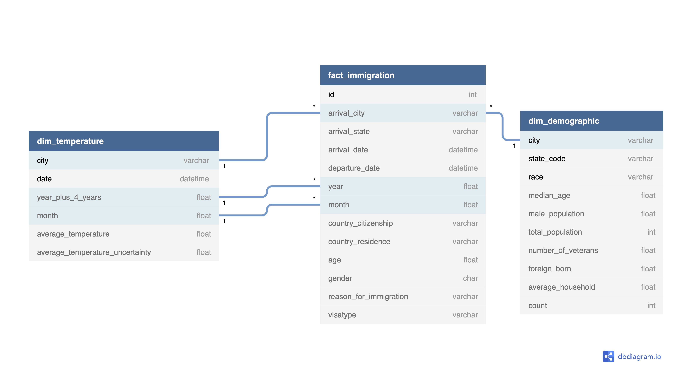

# United States Immigration study

## Data Engineering Capstone Project

## Table of contents
* [Launch](#Launch)
* [Project Summary](#Project_Summary)
* [Scope the Project](#Scope_the_Project)
* [The choice of tools and technologies.](#The_choice_of_tools_and_technologies.)
* [Describing the datasets](#Describing_the_datasets)
* [Conceptual Data Model](#Conceptual_Data_Model)
* [Mapping Out the Transformation](#Mapping_Out_the_Transformation)
* [Running the Pipeline](#Running_the_Pipeline)
* [Project Write Up](#Project_Write_Up)
* [Scheduling](#Scheduling)

## Launch

This project consists of a Jupyter Notebook and data sources located in the data folder. To run the notebook, you could clone the repo and run it, but the advisable thing to do is to run it on an EMR cluster in AWS. To launch the notebook in an EMR cluster, you would need to do the following:

- Go to EMR notebook and make a notebook with a new cluster
- Use a key-pair
- Link the notebook to this repository

### Project Summary
This project aims to unveil information about immigration into the United States. Questions like how the flow of immigrants changes seasonally, if the destinations are dependent on temperature, and where the immigrants come from are some of the key questions this study is trying to answer.

Data are extracted from three different dataset sources, "I94 Immigration Data" from U.S. National Tourism and Trade Office, "Global Land Temperatures By City" from kaggle, and finally "Us Cities Demographics" from OpenSoft.

Apache Spark, Jupyter Notebook, and potentially Amazon Elastic MapReduce, EMR, are used to accomplish this ETL pipeline, which then writes parquet files either to an Amazon S3 bucket or locally to disk.

### Scope the Project

The scope for this project is to create a Data Lake using an ETL pipeline. This Jupyter Notebook presents the whole process, describing and assessing the datasets, and at the bottom, running the complete ETL pipeline.  Ideally, this notebook should run on an EMR cluster in AWS, especially if using the whole immigration dataset. For this study, the star schema is chosen, making it possible to execute the various queries outlined below.  

### The choice of tools and technologies.

Apache Spark and Jupyter Notebook are the primary processing tools for this ETL pipeline. The ability for Spark to handle vast amounts of data in parallel, and the fact that AWS EMR supports Spark out of the box, makes Spark a compelling choice. The Jupyter Notebook is not only a great choice as an interactive environment for writing and running code but also works well as a tool for documenting.

#### Describing the datasets

- **I94 Immigration Data**: comes from the [U.S. National Tourism and Trade Office](https://travel.trade.gov/research/reports/i94/historical/2016.html) and contains  
various statistics on international visitor arrival in the USA and comes from the US National  
Tourism and Trade Office. The dataset contains data from 2016.

- **Temperature Data**: comes from [Kaggle](https://www.kaggle.com/berkeleyearth/climate-change-earth-surface-temperature-data) and is provided in a csv format, and includes  
information like average temperature, date, and city.

- **Demographic Data:** comes from [OpenSoft](https://public.opendatasoft.com/explore/dataset/us-cities-demographics/export/) and contains information about the demographics of all US cities such as race, male and female population, and median age. This dataset is from 2015.

#### This study tries to build an ETL and Data Model to answer the following questions:

- What cities in the U.S. are the most common for arriving immigrants?
- How does immigration change throughout a year?
- Where do the immigrants come from?
- What is the gender ratio for the immigrants?
- What is the age profile for the volume of immigrants?
- What is the legal status of immigrants in the U.S.

### Conceptual Data Model

As explained in the scope of the project, the Data Model is a Data Lake leading into a star schema. As opposed to a Data Warehouse, where each schema is normalized and tailored to a specific query through the 'schema-on-write' approach, the Data Lake uses a 'schema-on-read' approach, which gives more flexibility to what queries could be made.

To meet the requirements for the scope of the project a star schema with two dimensions is being made. The fact table consists of facts about the immigrants, and the two dimension tables will store information about temperatures per month per city and demographics for each city. This setup will hopefully allow analysts to make queries that answer the questions presented in the scope of the project.

### Mapping Out the Transformation

#### Transformation steps for the Immigration Data
- Date values need to be transformed to YYYY-MM-DD.
- Port values need validating.
- States need to correspond to the state codes in the Demographic Data.
- Filter i94visa column by mode of transportation to only let travel by air.
- Set the reasons for immigration.
- Filter genders.
- Capping age at 105
- Convert i94res codes to new country_residence column
- Convert i94cit codes to new country_citizenship column

#### Temperature Data transforming steps
- Filter only for US using pandas
- Drop rows with NaN in the AverageTemperature column
- Convert dt to datetime
- Only keep records from 2013
- For each city keep only one records per day
- Make city names upper case to match fact table

#### Demographic Data transforming steps
- Make city names upper case
- Drop NaNs

### Running the Pipeline

The ETL pipeline will consist of the following sections:
- #### Extraction
    - Extraction of csv and sas files
    - Extraction for dictionaries from the I94_SAS_Labels_Descriptions
- #### Transformation
    - Transforming of the Immigration Data
    - Transforming of the Temperature Data
    - Transforming of the Demographic Data
- #### Loading
    - Loading of the data to S3 or locally

### Project Write Up

* The rationale for the choice of tools and technologies is that Spark and EMR fit perfectly for this project. The built-in parallelization in Spark makes it an ideal tool for working with large amounts of data. In my opinion, a notebook like this is pretty necessary to at least set up the ETL. The ETL itself could, of course, be a python script, which then gets submitted to the EMR cluster.

#### Scheduling
* Since the data is aggregated in months, the ETL should be scheduled to run the first or the second day of every month.
